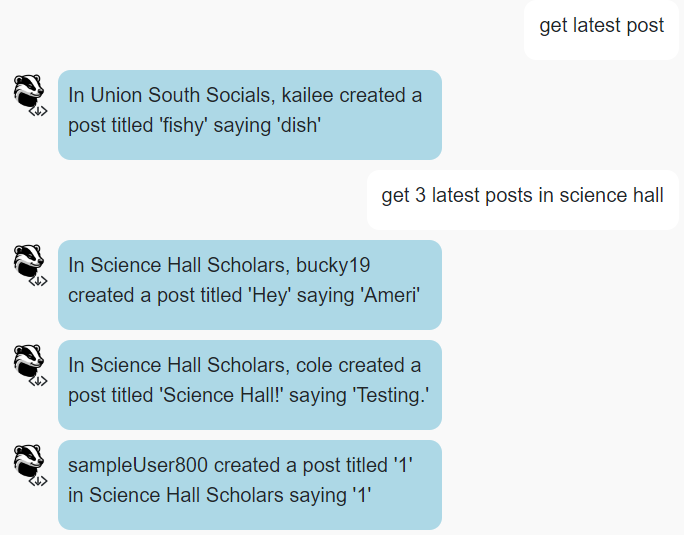

# BadgerChat

## Setup

In the directory, run

```bash
npm install
npm run dev
```

Then, in a browser, open `localhost:5173`.

## API Notes

See `API_DOCUMENTATION.md` for full details.

| Method | URL | Purpose | Return Codes |
| --- | --- | --- | --- |
| `GET`| `/chatrooms` | Get all chatrooms. | 200, 304 |
| `GET` | `/messages?chatroom=NAME&num=NUM`| Get latest `NUM` messages for specified chatroom. | 200, 400, 404 |
| `POST` | `/messages?chatroom=NAME` | Posts a message to the specified chatroom. | 200, 400, 404, 413 |
| `DELETE` | `/messages?id=ID` | Deletes the given message. | 200, 400, 401, 404 |
| `POST` | `/register` | Registers a user account. | 200, 400, 409, 413  |
| `POST` | `/login` | Logs a user in. | 200, 400, 401 |
| `POST` | `/logout` | Logs the current user out. | 200 |
| `GET` | `/whoami` | Gets details about the currently logged in user. | 200 |

## BadgerChat

### 1. `get_help`

Utterances along the lines of "help", "get help", or "what can I do" should trigger this intent.


### 2. `get_chatrooms`

Utterances along the lines of "chatrooms", "what chatrooms are there", or "what chatrooms can I use" should trigger this intent.


### 3. `get_messages`

Utterances along the lines of "messages", "give me the 4 latest posts", or "what are the 4 latest posts in Union South Socials" should trigger this intent.



### 4. `login`

Utterances along the lines of "login", "log in", or "log me in" should trigger this intent.


### 5. `register`

Utterances along the lines of "register", "sign me up", or "I want an account" should trigger this intent.


### 6. `whoami`

Utterances along the lines of "am I logged in", "who am I", or "who am I logged in as" should trigger this intent.


### 7. `logout`

Utterances along the lines of "logout", "log out", or "log me out" should trigger this intent.


### 8. `create_message`

Utterances along the lines of "create a post", "make a post in union south socials", or "post a message to picnic point pathfinders" should trigger this intent.


